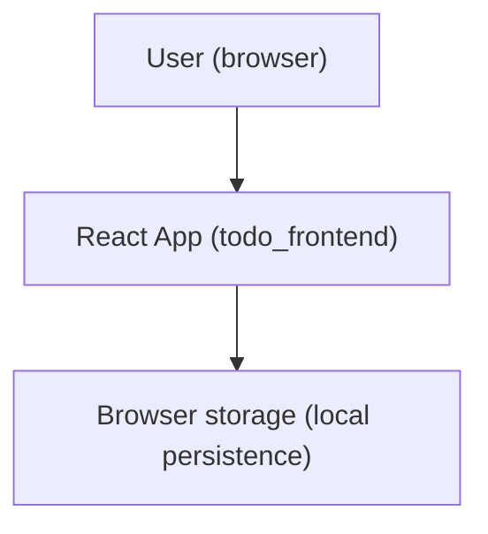

# Simple Todo Application

This repository contains a simple React frontend application for managing a list of todos.

## What is included

The project currently includes:

- `todo_frontend/`: A React (Create React App) frontend served in development on port `3000`.

## Features

The intended application features are:

- Create, read, update, and delete todos.
- Mark todos as complete or incomplete.
- Filter todos by status (all, active, completed).
- Responsive UI.
- Local persistence using browser storage.

## Quick start

To run the app locally, follow the instructions in:

- `todo_frontend/README.md`

## Architecture

This project is currently a single frontend container (a simple monolithic UI deployment with local, in-browser state/persistence).

