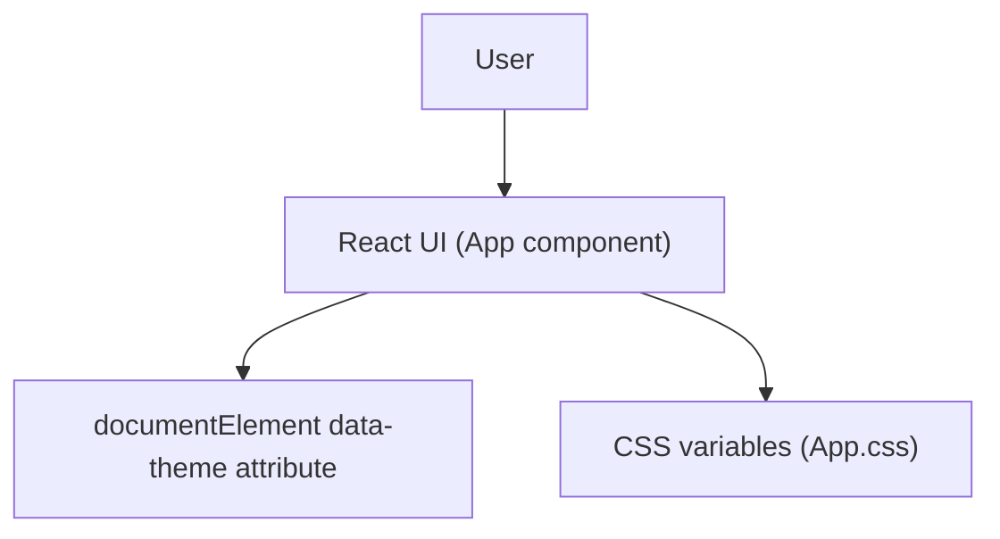

# Todo Frontend (React)

This folder contains the React frontend application (Create React App) for the simple todo project.

At the moment, the UI in `src/App.js` is a minimal React page that demonstrates a light/dark theme toggle and basic CRA scaffolding. The broader todo features described at the project level are planned, but not yet implemented in this container’s current source code.

## What is implemented right now

The current app provides:

- A light/dark theme toggle button that sets `data-theme` on the `documentElement`.
- Basic page styling driven by CSS variables in `src/App.css`.

## Running the app (development)

From this directory (`todo_frontend/`):

1. Install dependencies.
   ```bash
   npm install
   ```

2. Start the development server.
   ```bash
   npm start
   ```

Then open `http://localhost:3000`.

## Available scripts

These scripts are defined in `package.json`:

- `npm start`: Runs the app in development mode.
- `npm test`: Runs tests (Create React App / React Testing Library setup).
- `npm run build`: Builds a production bundle.
- `npm run eject`: Ejects CRA configuration (irreversible).

## Configuration (environment variables)

This container supports the following `REACT_APP_*` environment variables (as defined for the container environment). They are not currently used by the application code, but are available for future integration:

- `REACT_APP_API_BASE`
- `REACT_APP_BACKEND_URL`
- `REACT_APP_FRONTEND_URL`
- `REACT_APP_WS_URL`
- `REACT_APP_NODE_ENV`
- `REACT_APP_NEXT_TELEMETRY_DISABLED`
- `REACT_APP_ENABLE_SOURCE_MAPS`
- `REACT_APP_PORT`
- `REACT_APP_TRUST_PROXY`
- `REACT_APP_LOG_LEVEL`
- `REACT_APP_HEALTHCHECK_PATH`
- `REACT_APP_FEATURE_FLAGS`
- `REACT_APP_EXPERIMENTS_ENABLED`

## Code layout (high level)

- `src/App.js` contains the main `App` component and theme toggle logic.
- `src/App.css` contains the theme variables and responsive styling.
- `public/index.html` is the HTML template used by CRA.

## Architecture

This container is a single-page React application with UI state in memory and theme persisted only for the active session (no persistence is currently implemented for theme or todos).


